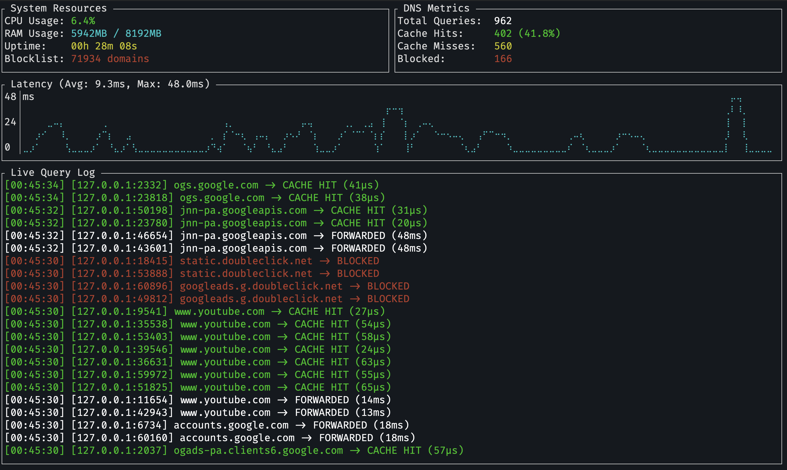

# rDNS

Welcome to `rdns`, the artisanal, hand-crafted, free-range DNS resolver you never knew you needed. Because relying on your ISP's DNS is so 2005.

## What is this? 🤔

`rdns` is a blazing fast (mostly because it aggressively caches things) DNS forwarder written in Rust. It sits between you and the internet, quietly judging your requests and occasionally saying "Nope" if you try to visit something on the blocklist.

It's like a bouncer for your internet traffic, but written in Rust so it's *memory safe* while it rejects you.

## Features ✨

*   **Caching that actually works:** We remember where `google.com` is so you don't have to ask every 5 milliseconds.
*   **Blocklisting:** We download a list of "bad" domains and pretend they don't exist. It's not censorship, it's *curated browsing*.
*   **Metrics:** We expose Prometheus metrics because if you can't graph your DNS latency, are you even an engineer?
*   **TUI (Terminal User Interface):** Look like a hacker from a 90s movie while monitoring your DNS traffic. Matrix rain not included (yet).
*   **Written in Rust:** So you can tell your friends you're running "blazingly fast" software.

## Usage 🚀

1.  **Build it:**
    ```bash
    cargo build --release
    ```
    (Go grab a coffee, it's Rust, it compiles... eventually.)

2.  **Run it:**
    ```bash
    sudo ./target/release/rdns
    ```
    *Note: Sudo is needed because we bind to port 53 by default. We promise not to rm -rf / (unless you ask nicely).*

    **Advanced Options:**
    Want to listen on a non-privileged port or use a different upstream resolver? We got you.
    ```bash
    ./target/release/rdns --port 5353 --resolver 8.8.8.8:53
    ```

    **Headless Mode:**
    Don't need the fancy TUI? Run it in headless mode:
    ```bash
    sudo ./target/release/rdns --no-tui
    ```

3.  **Point your DNS to it:**
    Change your computer's DNS settings to `127.0.0.1`.
    *Warning: If you break your internet, don't call us. We're probably debugging a borrow checker error.*

## The "I just want to see the pretty colors" Mode 🎨

Run the binary and marvel at the TUI. It shows logs, blocklist stats, and other things that make you feel like you're controlling the matrix.



## Contributing 🤝

Found a bug? Want to add a feature? PRs are welcome! Just make sure `cargo fmt` doesn't yell at you.

## License 📜

This project is licensed under the **MIT License**. Because we believe in freedom, and also because we don't want to be liable for anything.